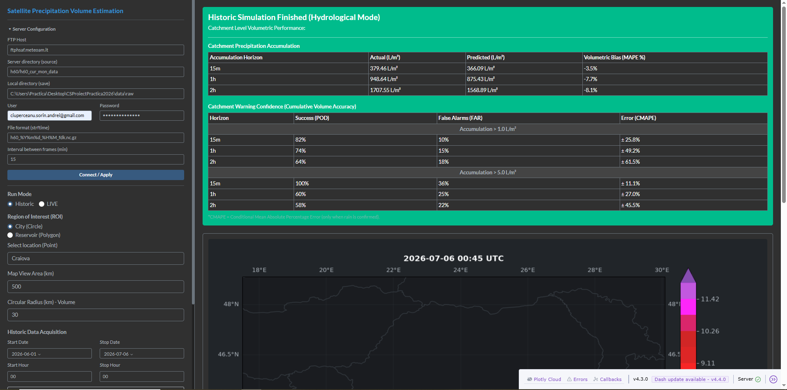
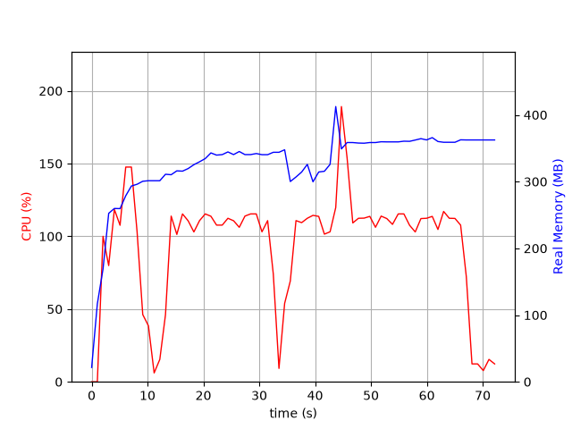
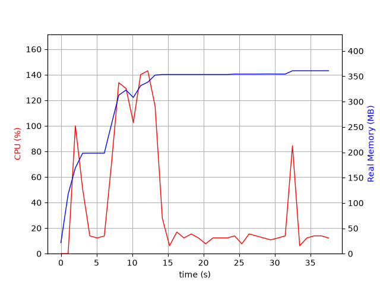

<div class="cover-page" align="center">
  <h1>Estimating Precipitation Volume from Satellite Products</h1>
  <p>Predictive Nowcasting System for Hydropower Reservoirs</p>
</div>

## Table of Contents
1. Executive Summary
2. Architecture and Data Pipeline
3. Data Sources and APIs Used
4. Storm Cell Detection
5. Cell Tracking (Storm Tracking)
6. Nowcasting Algorithm (Advection + Thermodynamics)
7. Volumetric Integration and Reservoir Fill Estimation
8. Running Modes: Live vs Historic
9. Constants Calibration (IS) and Validation (OOS)
10. Accuracy Results
11. Code Examples
12. Performance and Resource Consumption
13. Current Limitations and Future Improvements

## 1. Executive Summary

**Project Name**: Estimating Precipitation Volume from Satellite Products.

**Final Goal**: Estimating precipitation accumulations in hydropower reservoirs. These estimates can be subsequently used by HidroElectrica for better production management.

**Immediate Goal**: Identifying data acquisition and analysis methods to determine if a precipitation front will intersect the area of interest.

### What exactly does this system do?

Imagine you are driving a car. Looking in the rearview mirror shows you where you came from (the historical radar of precipitation), and looking forward through the windshield shows you what's coming. Our system does exactly this, but for rain and reservoirs:

1. **Sees** — Automatically downloads "photos" from space every 15 minutes from weather satellites (H60, SWOT, Sentinel-2).
2. **Detects** — Identifies rain "patches" (storm cells) on the map, calculating their center of mass, area, volume, and exact shape.
3. **Tracks** — Compares the current frame with previous ones to determine the direction and speed of each cell.
4. **Predicts** — Extrapolates cell movement into the future across three horizons: 15 minutes, 1 hour, and 2 hours. It also simulates how the storm intensifies or dissipates using thermodynamic equations.
5. **Calculates** — Overlays the prediction onto the exact catchment polygon of a dam and converts millimeters of rain into cubic meters of water that will actually reach the reservoir.
6. **Learns** — Continuously compares past predictions with reality and automatically adjusts its coefficients to become increasingly precise.

## 2. Architecture and Data Pipeline

The system executes a continuous pipeline in 4 major stages. The complete architecture diagram is presented below:


### Pipeline Stages:

**Stage 1 — Data Acquisition**: Precipitation maps are retrieved via FTP, physical lake levels via NASA Earthdata, water surface via Copernicus CDSE, digital elevation model from S3, and evapotranspiration data (Open-Meteo API).

**Stage 2 — Nowcasting Engine**: Storm cells are detected, tracked frame-by-frame, and extrapolated into the future.

**Stage 3 — Volumetric Integration**: The predicted precipitation is overlaid on the catchment basin polygons. The inflow is calculated, and surface evaporation and the dam's base outflow are subtracted.

**Stage 4 — Calibration and Output**: Predictions are corrected in real-time through In-Sample calibration. Results are displayed in the Dashboard.

## 3. Data Sources and APIs Used

The system integrates **6 external data sources**:

### 3.1. HSAF H60 (EUMETSAT / MeteoAM)
- **Protocol**: FTP/FTPS with automatic retry (3 attempts, 2-second backoff).
- **Server**: `ftphsaf.meteoam.it`, folder: `h60/h60_cur_mon_data`.
- **Format**: `.nc.gz` (Compressed NetCDF).
- **Temporal Resolution**: One frame every 15 minutes.
- **Preprocessing**: `.gz` decompression, reading geostationary coordinates from NetCDF, transforming to lat/lon, extracting the sub-matrix for the bounding box of interest.

### 3.2. NASA SWOT (Surface Water and Ocean Topography)
- **API**: NASA CMR (`https://cmr.earthdata.nasa.gov/search/granules.json`).
- **Authentication**: NASA Earthdata Login (`EDL_USER`, `EDL_PASS`).
- **Data Delivered**: Shapefiles with Water Surface Elevation (`wse`) for lakes and rivers in Romania.
- **Processing**: Download `.zip` → extract shapefile → `pyshp.Reader` → quality filtering → spatial matching with lake polygons.

### 3.3. Copernicus Sentinel-2 API (Sentinel Hub)
- **Token URL**: `https://identity.dataspace.copernicus.eu/auth/realms/CDSE/protocol/openid-connect/token`
- **Process URL**: `https://sh.dataspace.copernicus.eu/api/v1/process`
- **Catalog URL**: `https://sh.dataspace.copernicus.eu/api/v1/catalog/1.0.0/search`
- **Authentication**: `SH_ID`, `SH_SECRET`.
- **Resolution**: 10m/pixel. The polygon is reprojected to UTM, and a 300m buffer is added.
- **WSE Inversion**: The measured water surface is used to deduce the water level using the Stage-Storage curve.

### 3.4. Copernicus GLO-30 DEM (S3 Public)
- **URL**: `https://copernicus-dem-30m.s3.amazonaws.com`
- **Resolution**: 30m/pixel (1/3600°), 1°×1° tiles (3600×3600 pixels).
- **Usage**: Constructing Stage-Storage curves by integrating the volume above the water line. Delineating watersheds via the Priority-Flood + D8 Flow Routing algorithm.
- **Caching**: LRU cache in-memory (32 tiles) + disk persistence.

### 3.5. Open-Meteo Archive API (Evapotranspiration)
- **URL**: `https://archive-api.open-meteo.com/v1/archive`
- **Parameters**: `daily=precipitation_sum,et0_fao_evapotranspiration`
- **Usage**: Calculating surface evaporation during periods of missing satellite data. The `et0_fao_evapotranspiration` result (mm/day) is used to estimate water loss from the lake between the last SWOT/S2 observation and the simulation moment.
- **Monthly Fallback**: If the API is unresponsive, hardcoded monthly average values for Romania are used: January=0.5, February=0.8, ..., July=5.0, ..., December=0.5 mm/day.

### 3.6. NASA Earthdata CMR (Catalog)
- **URL**: `https://cmr.earthdata.nasa.gov/search/granules.json`
- **Usage**: Searching and paginating SWOT granules for Romania.

## 4. Storm Cell Detection

The `StormCellDetector` module (`src/core/detection/storm_cell_detector.py`) identifies precipitation regions from the radar matrix.

### Step 1 — Large Cells
1. Binarize the matrix.
2. Apply **binary opening** with a 3×3 structuring element (`np.ones((3,3))`) to remove isolated noise.
3. Label connected components using `scipy.ndimage.label()`.
4. Extract geometric properties with `skimage.measure.regionprops()`.
5. Filter cells.

### Step 2 — Small Cells
1. Same procedure with a lower threshold.
2. Eliminate any small cell whose pixels overlap with the already detected large cells (using `seen_mask`).

### Centroid Calculation (Rain Intensity Weighted)
The centroid is **not** geometric, but **weighted by precipitation mass**: This approach ensures the centroid gravitates toward the area with the highest precipitation concentration, rather than the geometric center of the shape.

### Properties Extracted Per Cell
- `centroid_x`, `centroid_y` — weighted centroid
- `area_pixels` — pixel count
- `volume` — sum of intensities
- `max_intensity`, `mean_intensity` — extreme and mean values
- `orientation`, `major_axis_length`, `minor_axis_length` — morphological parameters
- `coords` — list of all pixel coordinates

**Constants**: `threshold = RAIN_THRESHOLD_TRACKING = 1.0` mm/h, `min_size = 2` pixels.

## 5. Cell Tracking (Storm Tracking)

The `StormTracker` module (`src/core/tracking/storm_tracker.py`) tracks cells from one frame to the next, ensuring the continuity of their identity. It combines several algorithms:

### 5.1. 4D Kalman Filter (Constant Velocity Model)
Each tracked cell receives its own Kalman filter (`filterpy.kalman.KalmanFilter`):
- **State**: x, y, v_x, v_y — position + velocity (4D).
- **Observation**: x, y — centroid position only (2D).
- **Transition Matrix**
- **Process Noise** Q
- **Measurement Noise** R
- **Initial Covariance** P

### 5.2. Cell Matching (Matcher — KD-Tree + Hungarian)
The matching algorithm (`matcher.py`) works in 3 steps:

**Step 1 — KD-Tree Filtering**: A `scipy.spatial.cKDTree` is built from the Kalman-predicted positions of previous cells. It searches for all current cells within a 100-pixel radius.

**Step 2 — Hybrid Cost Calculation**: For each candidate pair (current cell, previous cell), a cost is calculated, consisting of:
- Normalized Euclidean distance
- Penalty for area difference and volume difference
- Intersection over Union (IoU) on the advected pixel coordinates
  Final Cost = Distance + 0.5 * Area + 0.5 * Volume + 1.5 * IoU.

**Step 3 — Hungarian Assignment**: The bipartite graph is decomposed into connected components (BFS), and `scipy.optimize.linear_sum_assignment()` is applied to each subproblem.

### 5.3. Velocity Inheritance for New Cells
New cells (unidentified in previous frames) have no velocity of their own. The system searches for the closest "parent" cell from the previous frame within the Mahalanobis limit.

### 5.4. Cell Lifecycle
The `CellLifecycleManager` keeps the history of the last 6 frames. The area trend is calculated as the geometric mean of the last 3 area ratios.
The lifecycle phase is determined by the `lifecycle()` function from the Reaction-Diffusion module.

## 6. Nowcasting Algorithm (Advection + Thermodynamics)

The `AdvectionEngine` (`src/core/nowcast/advection_engine.py`) is the predictive core of the system. It combines Lagrangian advection with an organic thermodynamic model.

### 6.1. Velocity Calculation Per Step
For each prediction step, the velocity is calculated as the **weighted median** across all tracked cells.

### 6.2. Kinematic Advection (KinematicAdvector)
Spatial propagation is done via `scipy.ndimage.shift(rain_rate, shift=(y, x), order=1, cval=0.0)` — a sub-pixel translation with bilinear interpolation.

### 6.3. Advection Blending
**3 variants** are calculated: 1. `shifted_raw` (ROI velocity); 2. `mass_shifted` (center of mass); 3. `damped_shifted` (half velocity × 0.90). The choice is made based on tracking confidence.

### 6.4. Mass Conservation
After blending, the mass loss caused by numerical diffusion is corrected.

### 6.5. Thermodynamics (Reaction-Diffusion)
The `reaction_diffusion.py` module simulates organic growth and dissipation through:
- **Spatial Diffusion**
- **Momentum Inertia**
- **Reaction (Thermodynamic Multiplier)**

### 6.6. Dry Guard (Protection Against False Predictions)
If tracking is uncertain, the latest real frames are dry, and the prediction is low, the predicted volume is reduced by 65%.

## 7. Volumetric Integration and Reservoir Fill Estimation

### 7.1. MAP Calculation (Mean Areal Precipitation)
The `Evaluator` (`src/core/metrics/evaluator.py`) calculates the mean areal precipitation over the ROI.

### 7.2. Fractional Intersection Mask
`PolygonIntersection` (`src/geo/intersection.py`) calculates the exact fraction of each pixel covered by the polygon:
- Fully interior pixels → fraction = 1.0
- Boundary pixels → the pixel polygon is built from the grid gradients.
- Boundary detection: `shapely.dwithin(point, exterior, pixel_radius × 1.5)`

### 7.3. Reservoir Fill Estimation
The hydrological model applies the mass balance equation by calculating inflow, outflow, and evaporation calculated via Open-Meteo.

### 7.4. Stage-Storage Curve (Level-Volume)
The system converts water elevation to volume by integrating Digital Elevation Model (DEM) data above the current water line using flood-fill. Below the water line, it extrapolates on a conical model.

## 8. Running Modes: Live vs Historic

The system operates in two distinct modes, selectable from the Dashboard interface:

### 8.1. Live Mode
- **Data Acquisition**: FTP polling every 15 minutes (`CloudDataService`). Searches retroactively max 5 steps.
- **Filtering**: Only files from the current day.
- **Latency Compensation**: H-SAF delay is calculated. If the frame is 30min delayed, the 1h prediction uses 6 steps instead of 4.
- **UI**: Automatic slider at the current frame.

### 8.2. Historic Mode
- **Data Acquisition**: Bulk downloads all frames in the interval (`download_range`).
- **Filtering**: Strictly restricted to `[start, end]`.
- **Static Steps**: 2 steps for 15m, 5 for 1h, 9 for 2h.
- **UI**: Manual controllable slider or via Play button.

### 8.3. Session Manager — Replay and Consistency
Manages isolated web sessions:
- Sessions have their own `Orchestrator`.
- Dataset change → full reset + replay from 0.
- Normal advance → incremental.
- Jump forward → rapidly accumulates intermediate frames.
- Inactivity expiration → 1 hour.

## 9. Constants Calibration (IS) and Validation (OOS)

### 9.1. What does "calibration" mean in this project's context?
Calibration refers to the **adjustment of all hardcoded constants** in the algorithms, not just dynamic feedback. The final values were determined through an iterative process:

1. **In-Sample (IS)**: The model is run on known historical data. Constants are adjusted manually and automatically until the average bias on the IS set drops below the acceptable threshold (±15%).
2. **Out-of-Sample (OOS)**: Constants are locked and run on a dataset the model has not seen during calibration. If OOS performance is comparable to IS, the constants are validated.

### 9.2. IS Calibrated and OOS Validated Constants

| Constant | Value | Meaning |
|-----------|---------|-------------|
| `_BIAS_MIN` | 0.45 | Lower limit for bias correction |
| `_BIAS_MAX` | 1.60 | Upper limit for bias correction |
| `_BIAS_ALPHA_UP` | 0.35 | Upward learning rate (EMA) |
| `_BIAS_ALPHA_DOWN` | 0.55 | Downward learning rate (EMA) |
| `_DRY_DECAY` | 0.003 | Revert rate to 1.0 in dry weather |
| `_WINDOW_SIZE` | 9 | Sliding median window size |
| `_DRY_GUARD_RECENT_MM` | 0.03 | Threshold for dry protection activation |
| `_DRY_GUARD_PRED_MAX` | 0.20 | Max prediction threshold for dry guard |
| `_MIN_FEEDBACK_MM` | 0.02 | Minimum threshold for bias update |
| `_STATIC_HORIZON_CALIBRATION` | `{15m: 1.0, 1h: 1.0, 2h: 1.065}` | Static correction per horizon |
| `HORIZON_STEPS` | `{15m: 2, 1h: 5, 2h: 9}` | Padded steps for H-SAF latency |
| `RAIN_THRESHOLD_MIN` | 1.0 mm/h | Minimum threshold to consider precipitation |
| `RUNOFF_COEFFICIENT` | 0.35 | Hydrological runoff coefficient |
| `MAX_TRACKING_DISTANCE_PX` | 18 | Maximum tracking distance (pixels) |
| Process noise Q (var) | 0.1 | Kalman filter process noise |
| Measurement noise R | diag(10, 10) | Kalman filter measurement noise |

All these values were calibrated **In-Sample** on historical periods and subsequently validated **Out-of-Sample** on unexplored periods.

### 9.3. Dynamic Calibration (Feedback Loop)
The engine corrects predictions in real-time by calculating the `actual / predicted` ratio at each step. A median window of the logarithm of these errors is maintained. Multipliers are adjusted through an asymmetric EMA (Exponential Moving Average) assimilation. If the 1-hour horizon overestimates, the 2-hour horizon receives a preventive downward *nudge*.

## 10. Accuracy Results

### 10.1. Screenshots — Full Period (2026-06-01 → 2026-07-06)

**Vidraru**:


**Portile de Fier I**:


**Craiova**:



### 10.2. OOS Validation Table — Period 1 (2026-06-24 → 2026-07-06)

| Location | 15m | 1h | 2h |
|---------|-----|----|----|
| Craiova | -6.2% | -14.6% | -21.6% |
| Vidraru | +2.4% | +3.3% | +7.5% |
| Portile De Fier I | -0.5% | -1.0% | -2.7% |
| Izvorul Muntelui | -5.5% | -10.5% | -3.6% |
| Gura Apelor | +11.9% | +21.2% | +35.1% |
| Tarnita | +3.5% | +10.1% | +19.2% |
| Somesu Cald | +2.5% | +13.4% | +20.9% |

### 10.3. OOS Validation Table — Full Period (2026-06-01 → 2026-07-06)

| Location | 15m | 1h | 2h |
|---------|-----|----|----|
| Craiova | -3.5% | -7.7% | -8.1% |
| Vidraru | -0.8% | -2.1% | -0.3% |
| Portile De Fier I | -0.7% | -2.2% | -3.7% |
| Izvorul Muntelui | -6.1% | -8.4% | -2.7% |
| Gura Apelor | -0.3% | +1.1% | +10.4% |
| Tarnita | -3.7% | -4.2% | 0% |
| Somesu Cald | -4.3% | -2.7% | +1.7% |

### 10.4. Aggregated Means Full Period

| Horizon | Absolute Mean Bias |
|---------|-------------------|
| **15m** | **2.8%** |
| **1h** | **4.1%** |
| **2h** | **3.8%** |

The absolute mean bias over the entire validation period remains below 5% across all three horizons, demonstrating the effectiveness of the IS/OOS calibration.

## 11. Code Examples

### Weighted Centroid Detection (`storm_cell_detector.py`):
```python
rain_values = rain_matrix[coords[:, 0], coords[:, 1]]
valid_mask = np.isfinite(rain_values) & (rain_values > 0)
if np.any(valid_mask):
    y_center, x_center = np.average(coords[valid_mask], axis=0, weights=rain_values[valid_mask])
```

### Hybrid Matching Cost (`matcher.py`):
```python
cost = (dist / actual_limit) + 0.5*(1-min(a1,a2)/max(a1,a2)) + 0.5*(1-min(v1,v2)/max(v1,v2)) + 1.5*(1-iou)
```

### Live Latency Compensation (`frame_processor.py`):
```python
if run_mode == "live" and frame_time is not None:
    delay = max(0, (datetime.datetime.utcnow() - frame_time).total_seconds() / 60.0)
    steps = {h: int(math.ceil((delay + m)/15.0 - 1e-3)) for h, m in [('15m',15), ('1h',60), ('2h',120)]}
```

### Dynamic Bias Calibration (`advection_engine.py`):
```python
if self._matured_pred_by_step[step] > self._MIN_FEEDBACK_MM:
    target = self._matured_actual_by_step[step] / self._matured_pred_by_step[step]
    target = float(np.clip(target, self._BIAS_MIN, self._BIAS_MAX))
else:
    target = float(np.exp(np.median(self._ratio_windows[step])))
```

### Hydrological Balance (`reservoir_fill.py`):
```python
new_v = max(start_v + inflow - outflow_m3 - evap_m3, 0.0)
```

## 12. Performance and Resource Consumption

The following graphs present the memory and processor usage profiles during system execution.

**Historic Mode**:
The system optimizes sequential processing, maintaining a reduced virtual memory footprint and intelligently utilizing processor cores during heavy calculation stages.



**Live Mode**:
In continuous live execution, consumption is streamlined for polling cycles, demonstrating rapid resource release between acquiring new data and running nowcast instances.



## 13. Current Limitations and Future Improvements

### 13.1. Current Limitations
1. **Linear Advection**: `KinematicAdvector` applies only uniform translations. It cannot model rotations, shears, or local divergences of the wind field.
2. **Fixed Runoff Coefficient**: `RUNOFF_COEFFICIENT = 0.35` is constant, independent of soil type, prior humidity, or slope.
3. **Temporal Resolution**: H60 provides a frame every 15 minutes. Fast convective storms can evolve significantly between two frames.
4. **Dependence on SWOT/S2 Data Quality**: The precision of the initial lake level depends on cloud coverage and satellite orbit frequency.

### 13.2. Future Improvements
1. **Optical Flow / Deep Learning**: Replacing kinematic advection with ConvLSTM, TrajGRU, or MetNet models that can anticipate rotations, air mass splits, and complex convective cycles.
2. **Hydrological Routing with DEM**: Using the already calculated D8 drainage network to effectively route water through tributary riverbeds, rather than directly overlaying the basin.
3. **Soil Moisture Data Integration (SMAP)**: Pre-calibrating the runoff coefficient based on soil saturation would eliminate large errors during the first rain after a prolonged drought.
4. **GPM Data Assimilation**: Integrating Global Precipitation Measurement data as a redundant source in case H60 is unavailable.
5. **Ensemble Prediction**: Running multiple scenarios with velocity and thermodynamic perturbations to generate confidence intervals, rather than point estimates.

## Appendix: Software Dependencies

| Package | Minimum Version | Usage |
|--------|----------------|-----------|
| `netCDF4` | ≥1.6.0 | Reading H60 files (.nc) |
| `numpy` | ≥1.22.0 | Matrix operations |
| `scipy` | ≥1.8.0 | `ndimage.shift`, `ndimage.label`, `cKDTree`, `linear_sum_assignment` |
| `shapely` | ≥2.0.0 | Geometric operations, `STRtree` |
| `matplotlib` | ≥3.5.0 | Map plotting |
| `cartopy` | ≥0.20.0 | Cartographic projections |
| `pyproj` | ≥3.4.0 | Coordinate transformations (Stereo 70 → WGS84, Geostationary → LatLon) |
| `filterpy` | ≥1.4.5 | 4D Kalman Filters |
| `scikit-image` | ≥0.19.0 | `regionprops` for morphological properties |
| `opencv-python-headless` | ≥4.8.0 | `findContours` for basin contour extraction |
| `dash` | ≥2.14.0 | Web framework for Dashboard |
| `dash-bootstrap-components` | ≥1.5.0 | Bootstrap components for UI |
| `pyshp` | ≥3.0.0 | Reading SWOT shapefiles |
| `tifffile` | ≥2024.1.0 | Reading GeoTIFF DEM tiles |
| `requests` | ≥2.28.0 | HTTP Calls (Sentinel Hub, Open-Meteo) |
