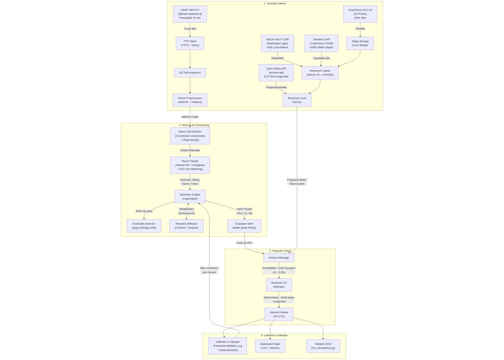
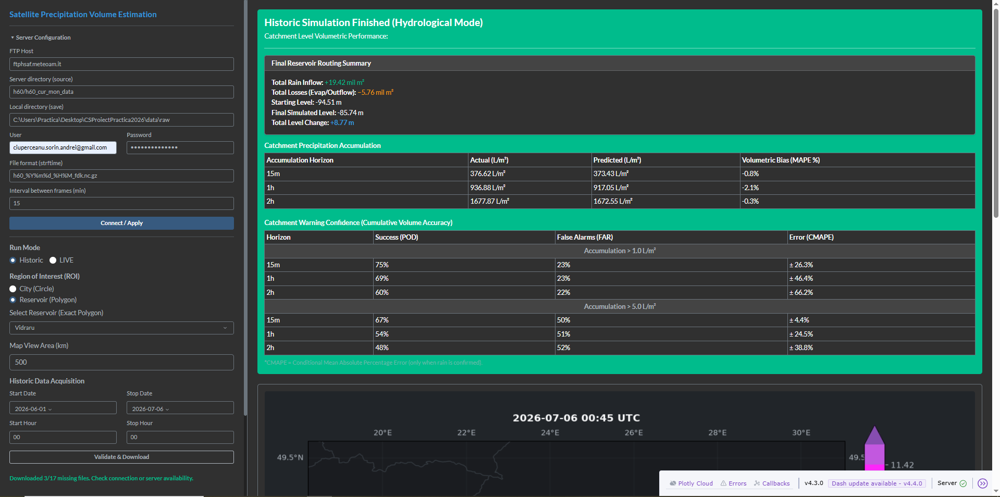

<div class="cover-page">
<h1 class="cover-title">Estimarea Volumului de Precipitații din Produse Satelitare</h1>
<p class="cover-subtitle">Sistem Predictiv de Nowcasting pentru Lacurile de Acumulare</p>
</div>


<div style="page-break-before: always;"></div>

## Cuprins
1. Rezumat 
2. Arhitectura și pipeline-ul de date
3. Surse de date și API-uri utilizate
4. Detecția celulelor de furtună
5. Urmărirea celulelor (Storm Tracking)
6. Algoritmul de nowcasting (Advecție + Termodinamică)
7. Integrarea volumetrică și estimarea umplerii lacurilor
8. Moduri de rulare: Live vs Istoric 
9. Calibrarea Constantelor (IS) și Validarea (OOS)
10. Rezultate de acuratețe
11. Exemple din cod
12. Limitări și imbunătățiri viitoare


<div style="page-break-before: always;"></div>

## 1. Rezumat executiv

**Nume proiect**: Estimare volumului de precipitații din produse satelitare.

**Scop final**: Estimarea acumulărilor de precipitații în bazinele de acumulare a barajelor. Aceste estimări pot fi folosite ulterior de HidroElectrica pentru un mai bun management al producției.

**Scop imediat**: Identificarea metodelor de achiziție și analiză a datelor spre a stabili dacă un front de precipitații va intersecta aria de interes.

### Ce face concret acest sistem?

Imaginați-vă că sunteți la volanul unei mașini. Privirea în oglinda retrovizoare vă arată de unde veniți (istoricul radar al precipitațiilor), iar privirea înainte prin parbriz vă arată ce urmează. Sistemul nostru face exact acest lucru, dar pentru ploaie și lacuri de acumulare:

1. **Vede** — Descarcă automat "fotografii" din spațiu la fiecare 15 minute de la sateliții meteorologici (H60, SWOT, Sentinel-2). Acestea conțin o hartă a intensității ploii pe întreaga Românie.
2. **Detectează** — Identifică "petele" de ploaie (celulele de furtună) din hartă, calculându-le centrul de masă, aria, volumul și forma exactă.
3. **Urmărește** — Compară cadrul curent cu cele anterioare pentru a determina direcția și viteza fiecărei celule folosind filtre Kalman.
4. **Prezice** — Extrapolează mișcarea celulelor în viitor pe trei orizonturi: 15 minute, 1 oră și 2 ore. Simulează și cum se intensifică sau disipează furtuna folosind ecuații de termodinamică.
5. **Calculează** — Suprapune predicția peste poligonul exact al bazinului hidrografic al unui baraj și convertește milimetrii de ploaie în metri cubi de apă care vor ajunge efectiv în lac.
6. **Învață** — Compară continuu predicțiile anterioare cu realitatea și își ajustează automat coeficienții pentru a fi din ce în ce mai precis.


<div style="page-break-before: always;"></div>

## 2. Arhitectura și pipeline-ul de date

Sistemul execută un pipeline continuu în 4 etape majore. Diagrama completă a arhitecturii este prezentată mai jos:



### Etapele Pipeline-ului:

**Etapa 1 — Achiziția Datelor**: Se preiau hărți de precipitații (H60) via FTP, nivelurile fizice ale lacurilor (SWOT) via NASA Earthdata, suprafața apei (Sentinel-2) via Copernicus CDSE, modelul digital de elevație (DEM GLO-30) de pe S3, și date de evapotranspirație (Open-Meteo API).

**Etapa 2 — Motorul de Nowcasting**: Celulele de furtună sunt detectate (`StormCellDetector`), urmărite cadru cu cadru (`StormTracker` cu Kalman 4D și Hungarian Matching), și extrapolate în viitor.

**Etapa 3 — Integrarea Volumetrică**: Precipitația prezisă este suprapusă peste poligoanele bazinelor hidrografice. Se calculează debitul de intrare, se scade evaporarea de suprafață și debitul de bază al barajului. 

**Etapa 4 — Calibrare și Output**: Predicțiile sunt corectate în timp real prin calibrare In-Sample (fereastră mediană logaritmică). Rezultatele sunt afișate în Dashboard-ul Dash și validate Out-of-Sample prin scriptul `run_simulations.py`.


<div style="page-break-before: always;"></div>

## 3. Surse de date și API-uri utilizate

Sistemul integrează **6 surse externe de date**:

### 3.1. HSAF H60 (EUMETSAT / MeteoAM)
- **Protocol**: FTP/FTPS cu retry automat (3 încercări, backoff de 2 secunde).
- **Server**: `ftphsaf.meteoam.it`, folder: `h60/h60_cur_mon_data`.
- **Format**: `.nc.gz` (NetCDF comprimat). Conține variabila `rr` (rain rate, mm/h).
- **Rezoluție temporală**: Un cadru la fiecare 15 minute.
- **Preprocesare**: Decompresia `.gz`, citirea coordonatelor geostaționare din NetCDF, transformarea în lat/lon via `pyproj` (proiecție geostaționară → WGS84), extragerea sub-matricei pentru bbox-ul de interes.

### 3.2. NASA SWOT (Surface Water and Ocean Topography)
- **API**: NASA CMR (`https://cmr.earthdata.nasa.gov/search/granules.json`).
- **Autentificare**: NASA Earthdata Login (`EDL_USER`, `EDL_PASS`).
- **Date livrate**: Shapefiles cu Water Surface Elevation (`wse`) pentru lacuri și râuri din România (`bounding_box=20.0,43.5,30.0,48.5`).
- **Procesare**: Descărcare `.zip` → extragere shapefile → `pyshp.Reader` → filtrare calitate (`quality_f ∈ {0, 1}`) → potrivire spațială cu poligoanele lacurilor folosind `shapely.STRtree`.

### 3.3. Copernicus Sentinel-2 API (Sentinel Hub)
- **Token URL**: `https://identity.dataspace.copernicus.eu/auth/realms/CDSE/protocol/openid-connect/token`
- **Process URL**: `https://sh.dataspace.copernicus.eu/api/v1/process`
- **Catalog URL**: `https://sh.dataspace.copernicus.eu/api/v1/catalog/1.0.0/search`
- **Autentificare**: `SH_ID`, `SH_SECRET` (OAuth2 client credentials).
- **Rezoluție**: 10m/pixel. Se reproiectează poligonul în UTM, se adaugă buffer de 300m.
- **Inversare WSE**: Din suprafața de apă măsurată se deduce cota apei folosind curba Stage-Storage.

### 3.4. Copernicus GLO-30 DEM (S3 Public)
- **URL**: `https://copernicus-dem-30m.s3.amazonaws.com`
- **Rezoluție**: 30m/pixel (1/3600°), tile-uri de 1°×1° (3600×3600 pixeli).
- **Utilizare**: Construcția curbelor Stage-Storage prin integrarea volumului deasupra liniei apei. Delinearea bazinelor hidrografice prin algoritmul Priority-Flood + D8 Flow Routing.
- **Caching**: LRU cache in-memory (32 tile-uri) + persistență pe disc.

### 3.5. Open-Meteo Archive API (Evapotranspirație)
- **URL**: `https://archive-api.open-meteo.com/v1/archive`
- **Parametri**: `daily=precipitation_sum,et0_fao_evapotranspiration`
- **Utilizare**: Calculul evaporării de suprafață în perioadele de lipsă a datelor satelitare (fast-forward). Rezultatul `et0_fao_evapotranspiration` (mm/zi) este folosit pentru a estima pierderea de apă din lac între ultima observație SWOT/S2 și momentul simulării.
- **Fallback lunar**: Dacă API-ul nu răspunde, se folosesc valori medii lunare hardcodate pentru România: Ianuarie=0.5, Februarie=0.8, ..., Iulie=5.0, ..., Decembrie=0.5 mm/zi.

### 3.6. NASA Earthdata CMR (Catalog)
- **URL**: `https://cmr.earthdata.nasa.gov/search/granules.json`
- **Utilizare**: Căutarea și paginarea granulelor SWOT pentru România.


<div style="page-break-before: always;"></div>

## 4. Detecția celulelor de furtună

Modulul `StormCellDetector` (`src/core/detection/storm_cell_detector.py`) identifică regiunile discrete de precipitații din matricea radar. Algoritmul folosește o strategie **dual-threshold connected-component labeling**:

### Pasul 1 — Celule Mari
1. Se binarizează matricea. 
2. Se aplică **binary opening** cu un element structurant 3×3 (`np.ones((3,3))`) pentru a elimina zgomotul izolat.
3. Se etichetează componentele conexe folosind `scipy.ndimage.label()`.
4. Se extrag proprietățile geometrice cu `skimage.measure.regionprops()`.
5. Se filtrează celulele.

### Pasul 2 — Celule Mici
1. Aceeași procedură cu threshold mai mic.
2. Se elimină orice celulă mică ale cărei pixeli se suprapun cu celulele mari deja detectate (folosind `seen_mask`).

### Calculul Centroidului (Ponderat cu Intensitatea Ploii)
Centroidul **nu** este geometric, ci **ponderat cu masa de precipitație**:Aceasta abordare asigură că centroidul gravitează spre zona cu cea mai mare concentrație de precipitații, nu spre centrul geometric al formei.

### Proprietăți Extrase per Celulă
- `centroid_x`, `centroid_y` — centroidul ponderat
- `area_pixels` — numărul de pixeli
- `volume` — suma intensităților 
- `max_intensity`, `mean_intensity` — valorile extreme și medii
- `orientation`, `major_axis_length`, `minor_axis_length` — parametri morfologici 
- `coords` — lista tuturor coordonatelor pixelilor

**Constante de producție**: `threshold = RAIN_THRESHOLD_TRACKING = 1.0` mm/h, `min_size = 2` pixeli.


<div style="page-break-before: always;"></div>

## 5. Urmărirea celulelor (storm tracking)

Modulul `StormTracker` (`src/core/tracking/storm_tracker.py`) urmărește celulele de la un cadru la altul, asigurând continuitatea identității lor. Acesta combină mai mulți algoritmi:

### 5.1. Filtrul Kalman 4D (Constant Velocity Model)
Fiecare celulă urmărită primește un filtru Kalman propriu (`filterpy.kalman.KalmanFilter`):
- **Starea**: x, y, v_x, v_y — poziție + viteză (4D).
- **Observația**: x,y — doar poziția centroidului (2D).
- **Matricea de tranziție** 
- **Zgomot de proces** Q
- **Zgomot de măsurare** R
- **Covarianță inițială** P

### 5.2. Potrivirea Celulelor (Matcher — KD-Tree + Hungarian)
Algoritmul de matching (`matcher.py`) funcționează în 3 pași:

**Pasul 1 — Filtrare KD-Tree**: Se construiește un `scipy.spatial.cKDTree` din pozițiile prezise Kalman ale celulelor anterioare. Se caută toate celulele curente aflate într-o rază de 100 pixeli.

**Pasul 2 — Calculul costului hibrid**: Pentru fiecare pereche candidat (celulă curentă, celulă anterioară) se calculează un cost compus din:
- Distanța euclidiană normalizată
- Penalizare pentru diferența de arie și diferența de volum
- Intersection over Union (IoU) pe coordonatele pixelilor advectați
Costul final = Distanță + 0.5 * Arie + 0.5 * Volum + 1.5 * IoU.

**Pasul 3 — Hungarian Assignment**: Se descompune graful bipartit în componente conexe (BFS), se aplică `scipy.optimize.linear_sum_assignment()` pe fiecare subproblemă.

### 5.3. Moștenirea Vitezei pentru Celule Noi
Celulele noi (neidentificate în cadrele anterioare) nu au viteză proprie. Sistemul caută cea mai apropiată celulă "părinte" din cadrul anterior în limita Mahalanobis.

### 5.4. Ciclul de Viață al Celulei
`CellLifecycleManager` păstrează istoria ultimelor 6 cadre. Trendul de arie se calculează ca media geometrică a ultimelor 3 raporturi de arie.

Faza ciclului de viață se stabilește prin funcția `lifecycle()` din modulul Reaction-Diffusion.


<div style="page-break-before: always;"></div>

## 6. Algoritmul de nowcasting (advecție + termodinamică)

`AdvectionEngine` (`src/core/nowcast/advection_engine.py`) este nucleul predictiv al sistemului. Combină advecție Lagrangiană cu un model termodinamic organic.

### 6.1. Calculul Vitezei per Pas
Pentru fiecare pas de predicție, viteza se calculează ca **mediană ponderată** peste toate celulele urmărite.

### 6.2. Advecția Cinematică (KinematicAdvector)
Propagarea spațială se face prin `scipy.ndimage.shift(rain_rate, shift=(y, x), order=1, cval=0.0)` — o translație sub-pixel cu interpolare bilineară.

### 6.3. Blending-ul celor 3 Componente Advectate
La fiecare pas, se calculează **3 variante** ale hărții advectate:
1. **`shifted_raw`**: Translație completă cu viteza ROI.
2. **`mass_shifted`**: Translație cu viteza centrului de masă global.
3. **`damped_shifted`**: Translație la jumătate de viteză × 0.90.
Se determina pe baza încrederii în tracking.

### 6.4. Conservarea Masei
După blending, se corectează pierderea de masă cauzată de difuzia numerică.

### 6.5. Termodinamica (Reaction-Diffusion)
Furtunile nu rămân identice. Modulul `reaction_diffusion.py` simulează organic creșterea și disiparea lor:

**Difuzie Spațială**

**Inerția Momentului**

**Reacția (Multiplicatorul Termodinamic)**:


### 6.6. Dry Guard (Protecția contra Predicțiilor False)
Dacă tracking-ul este nesigur , ultimele cadre reale sunt uscate , și predicția este scăzută , volumul prezis este redus cu 65%.


<div style="page-break-before: always;"></div>

## 7. Integrarea volumetrică și estimarea umplerii lacurilor

### 7.1. Calculul MAP (mean areal precipitation)
`Evaluator` (`src/core/metrics/evaluator.py`) calculează precipitația medie areală pe ROI:

### 7.2. Masca Fracțională de Intersecție
`PolygonIntersection` (`src/geo/intersection.py`) calculează fracția exactă a fiecărui pixel acoperit de poligon:
- Pixelii complet interiori → fracție = 1.0
- Pixelii de graniță → se construiește poligonul pixelului din gradienții grilei.
- Detecția graniței: `shapely.dwithin(punct, exterior, raza\_pixel × 1.5)`

### 7.3. Estimarea umplerii rezervorului
Modelul hidrologic aplică ecuația de bilanț calculând debitul de intrare (ținând cont de coeficientul de scurgere $C_{runoff}=0.35$), debitul de ieșire și evaporarea calculată via Open-Meteo.

### 7.4. Curba stage-storage (nivel-volum)
Sistemul convertește cota apei în volum prin integrarea datelor din Modelul Digital de Elevație (DEM) deasupra liniei apei curente folosind flood-fill. Sub linia apei se extrapolează pe un model conic.


<div style="page-break-before: always;"></div>

## 8. Moduri de rulare: live vs istoric 

Sistemul operează în două moduri distincte, selectabile din interfața Dashboard:

### 8.1. Modul Live
- **Achiziția datelor**: `CloudDataService.fetch_latest()` — polling FTP la fiecare **15 minute**. Caută retroactiv până la 5 pași (75 min) cel mai recent fișier disponibil. Descarcă și ultimele 3 cadre anterioare pentru warm-up-ul tracking-ului.
- **Filtrarea fișierelor**: `FrameStore.filtered(mode="live")` returnează doar fișierele din ziua curentă (`datetime.utcnow().date()`).
- **Compensarea Latenței**: `FrameProcessor` calculează întârzierea reală.Asta înseamnă că dacă cadrul a fost produs acum 30 de minute, predicția "la 1 oră" va folosi 6 pași în loc de 4.
- **Interfață**: Date picker-ul este dezactivat, slider-ul avansează automat la cadrul cel mai nou, raportul arată "Live Performance (Cumulative Stats)".

### 8.2. Modul Istoric 
- **Achiziția datelor**: `CloudDataService.download_range(start_dt, end_dt)` — descarcă bulk toate cadrele din intervalul selectat.
- **Filtrarea fișierelor**: `FrameStore.filtered()` returnează toate fișierele ale căror timestamp-uri se încadrează în intervalul `[start, end]`.
- **Pași statici**: Se folosesc orizonturile predefinite din `HORIZON_STEPS = {"15m": 2, "1h": 5, "2h": 9}`. Fiecare pas = 15 minute, cu o compensare de 1 pas pentru latența H-SAF.
- **Interfață**: Toate controalele sunt active. Slider-ul este manual sau controlat prin butonul Play (animație la 200ms/cadru). La ultimul cadru, se afișează raportul final cu tabelul de acuratețe.

### 8.3. Session Manager — Replay și Consistență
`SessionManager` gestionează starea fiecărei sesiuni utilizator:
- Fiecare sesiune primește propriul `Orchestrator` și `FrameHistory`.
- La schimbarea datasetului (mod, interval, bbox) → **reset complet** + replay de la cadrul 0.
- La avansare consecutivă (cadru N → N+1) → procesare incrementală.
- La salt înainte → se acumulează toate cadrele intermediare.
- **Expirare**: Sesiunile inactive peste **3600 secunde** (1 oră) sunt șterse automat.


<div style="page-break-before: always;"></div>

## 9. Calibrarea constantelor (IS) și validarea (OOS)

### 9.1. Ce înseamnă "calibrare" în contextul acestui proiect?

Calibrarea se referă la **ajustarea tuturor constantelor hardcodate** din algoritmi, nu doar la feedback-ul dinamic. Valorile finale au fost determinate printr-un proces iterativ:

1. **In-Sample (IS)**: Se rulează modelul pe date istorice cunoscute. Se ajustează manual și automat constantele până când bias-ul mediu pe setul IS scade sub pragul acceptabil (±15%).
2. **Out-of-Sample (OOS)**: Se blochează constantele și se rulează pe un set de date pe care modelul nu le-a văzut în timpul calibrării. Dacă performanța OOS este comparabilă cu IS, constantele sunt validate.

### 9.2. Constantele Calibrate IS și Validate OOS

| Constantă | Valoare | Semnificație |
|-----------|---------|-------------|
| `_BIAS_MIN` | 0.45 | Limita inferioară a corecției bias |
| `_BIAS_MAX` | 1.60 | Limita superioară a corecției bias |
| `_BIAS_ALPHA_UP` | 0.35 | Rata de învățare ascendentă (EMA) |
| `_BIAS_ALPHA_DOWN` | 0.55 | Rata de învățare descendentă (EMA) |
| `_DRY_DECAY` | 0.003 | Rata de revenire la 1.0 pe vreme uscată |
| `_WINDOW_SIZE` | 9 | Dimensiunea ferestrei mediane glisante |
| `_DRY_GUARD_RECENT_MM` | 0.03 | Pragul pentru activarea protecției dry |
| `_DRY_GUARD_PRED_MAX` | 0.20 | Pragul maxim al predicției pentru dry guard |
| `_MIN_FEEDBACK_MM` | 0.02 | Pragul minim pentru actualizarea bias-ului |
| `_STATIC_HORIZON_CALIBRATION` | `{15m: 1.0, 1h: 1.0, 2h: 1.065}` | Corecție statică per orizont |
| `HORIZON_STEPS` | `{15m: 2, 1h: 5, 2h: 9}` | Pași cu padding pentru latența H-SAF |
| `RAIN_THRESHOLD_MIN` | 1.0 mm/h | Pragul minim pentru a considera precipitația |
| `RUNOFF_COEFFICIENT` | 0.35 | Coeficientul de scurgere hidrologic |
| `MAX_TRACKING_DISTANCE_PX` | 18 | Distanța maximă de urmărire (pixeli) |
| Proces noise Q (var) | 0.1 | Zgomotul de proces al filtrului Kalman |
| Measurement noise R | diag(10, 10) | Zgomotul de măsurare al filtrului Kalman |

Toate aceste valori au fost calibrate **In-Sample** pe perioade istorice și ulterior validate **Out-of-Sample** pe perioade neexplorate.

### 9.3. Calibrarea dinamică (feedback loop)
Motorul corectează predicțiile în timp real calculând raportul `actual / predicted` la fiecare pas. Se menține o fereastră mediană a logaritmului acestor erori. Ajustarea multiplicatorilor se face printr-o asimilare EMA (Exponential Moving Average) asimetrică. Dacă orizontul de 1 oră supraestimează, orizontul de 2 ore primește un *nudge* preventiv în jos.


<div style="page-break-before: always;"></div>

## 10. Rezultate de acuratețe

### 10.1. Capturi de ecran — Full Period (2026-06-01 → 2026-07-06)

**Vidraru**:



**Portile de Fier I**:


**Craiova**:


### 10.2. Tabel de validare OOS — Period 1 (2026-06-24 → 2026-07-06)

| Locație | 15m | 1h | 2h |
|---------|-----|----|----|
| Craiova | -6.2% | -14.6% | -21.6% |
| Vidraru | +2.4% | +3.3% | +7.5% |
| Portile De Fier I | -0.5% | -1.0% | -2.7% |
| Izvorul Muntelui | -5.5% | -10.5% | -3.6% |
| Gura Apelor | +11.9% | +21.2% | +35.1% |
| Tarnita | +3.5% | +10.1% | +19.2% |
| Somesu Cald | +2.5% | +13.4% | +20.9% |

### 10.3. Tabel de validare OOS — Full Period (2026-06-01 → 2026-07-06)

| Locație | 15m | 1h | 2h |
|---------|-----|----|----|
| Craiova | -3.5% | -7.7% | -8.1% |
| Vidraru | -0.8% | -2.1% | -0.3% |
| Portile De Fier I | -0.7% | -2.2% | -3.7% |
| Izvorul Muntelui | -6.1% | -8.4% | -2.7% |
| Gura Apelor | -0.3% | +1.1% | +10.4% |
| Tarnita | -3.7% | -4.2% | 0% |
| Somesu Cald | -4.3% | -2.7% | +1.7% |

### 10.4. Medii Agregate Full Period

| Orizont | Bias Mediu Absolut |
|---------|-------------------|
| **15m** | **2.8%** |
| **1h** | **4.1%** |
| **2h** | **3.8%** |

Bias-ul mediu absolut pe întreaga perioadă de validare rămâne sub 5% pe toate cele trei orizonturi, demonstrând eficacitatea calibrării IS/OOS.


<div style="page-break-before: always;"></div>

## 11. Exemple din cod

### Detecția centroidului ponderat (`storm_cell_detector.py`):
```python
rain_values = rain_matrix[coords[:, 0], coords[:, 1]]
valid_mask = np.isfinite(rain_values) & (rain_values > 0)
if np.any(valid_mask):
    y_center = np.average(coords[valid_mask, 0], weights=rain_values[valid_mask])
    x_center = np.average(coords[valid_mask, 1], weights=rain_values[valid_mask])
```

### Costul Hibrid de Matching (`matcher.py`):
```python
dist_norm = dist / actual_limit
area_penalty = 1.0 - min(a1, a2) / (max(a1, a2) + 1e-5)
volume_penalty = 1.0 - min(v1, v2) / (max(v1, v2) + 1e-5)
iou_penalty = 1.0 - iou
cost = dist_norm + area_penalty*0.5 + volume_penalty*0.5 + iou_penalty*1.5
```

### Compensarea Latenței Live (`frame_processor.py`):
```python
if run_mode == "live" and frame_time is not None:
    now = datetime.datetime.now(datetime.UTC).replace(tzinfo=None)
    delay_minutes = max(0.0, (now - frame_time).total_seconds() / 60.0)
    epsilon = 1e-3
    step_15m = int(math.ceil(((delay_minutes + 15) / 15.0) - epsilon))
    step_1h  = int(math.ceil(((delay_minutes + 60) / 15.0) - epsilon))
    step_2h  = int(math.ceil(((delay_minutes + 120) / 15.0) - epsilon))
```

### Calibrarea Dinamică a Bias-ului (`advection_engine.py`):
```python
if self._matured_pred_by_step[step] > self._MIN_FEEDBACK_MM:
    target = self._matured_actual_by_step[step] / self._matured_pred_by_step[step]
    target = float(np.clip(target, self._BIAS_MIN, self._BIAS_MAX))
else:
    target = float(np.exp(np.median(self._ratio_windows[step])))
```

### Bilanțul Hidrologic (`reservoir_fill.py`):
```python
new_v = max(start_v + inflow - outflow_m3 - evap_m3, 0.0)
```


<div style="page-break-before: always;"></div>

## 12. Limitări și îmbunătățiri viitoare

### 12.1. Limitări curente
1. **Advecția liniară**: `KinematicAdvector` aplică doar translații uniforme. Nu poate modela rotații, forfecări sau divergențe locale ale câmpului de vânt.
2. **Coeficient de scurgere fix**: `RUNOFF_COEFFICIENT = 0.35` este constant, independent de tipul de sol, umiditatea anterioară sau pantă.
3. **Rezoluția temporală**: H60 oferă un cadru la 15 minute. Furtunile convective rapide pot evolua semnificativ între două cadre.
4. **Dependența de calitatea datelor SWOT/S2**: Precizia nivelului inițial al lacului depinde de acoperirea norilor și de frecvența orbitelor satelitare.

### 12.2. Îmbunătățiri Viitoare
1. **Optical Flow / Deep Learning**: Înlocuirea advecției cinematice cu modele de tip ConvLSTM, TrajGRU sau MetNet care pot anticipa rotații, divizări ale maselor de aer și cicluri convective complexe.
2. **Routing Hidrologic cu DEM**: Utilizarea rețelei de drenaj D8 deja calculată pentru a ruta efectiv apa prin albiile râurilor afluente, nu doar prin suprapunerea directă pe bazin.
3. **Integrarea Datelor de Umiditate a Solului (SMAP)**: Pre-calibrarea coeficientului de scurgere în funcție de saturația solului ar elimina erorile mari la prima ploaie după o secetă prelungită.
4. **Asimilare de date GPM**: Integrarea datelor Global Precipitation Measurement ca sursă redundantă în cazul indisponibilității H60.
5. **Predicție ensemble**: Rularea mai multor scenarii cu perturbații ale vitezei și termodinamicii pentru a genera intervale de confidență, nu doar estimări punctuale.


<div style="page-break-before: always;"></div>

## Anexă: Dependențe software

| Pachet | Versiune minimă | Utilizare |
|--------|----------------|-----------|
| `netCDF4` | ≥1.6.0 | Citirea fișierelor H60 (.nc) |
| `numpy` | ≥1.22.0 | Operații matriceale |
| `scipy` | ≥1.8.0 | `ndimage.shift`, `ndimage.label`, `cKDTree`, `linear_sum_assignment` |
| `shapely` | ≥2.0.0 | Operații geometrice, `STRtree` |
| `matplotlib` | ≥3.5.0 | Plotare hărți |
| `cartopy` | ≥0.20.0 | Proiecții cartografice |
| `pyproj` | ≥3.4.0 | Transformări de coordonate (Stereo 70 → WGS84, Geostationar → LatLon) |
| `filterpy` | ≥1.4.5 | Filtre Kalman 4D |
| `scikit-image` | ≥0.19.0 | `regionprops` pentru proprietăți morfologice |
| `opencv-python-headless` | ≥4.8.0 | `findContours` pentru extragerea contururilor de bazin |
| `dash` | ≥2.14.0 | Framework web pentru Dashboard |
| `dash-bootstrap-components` | ≥1.5.0 | Componente Bootstrap pentru UI |
| `pyshp` | ≥3.0.0 | Citirea shapefiles SWOT |
| `tifffile` | ≥2024.1.0 | Citirea tile-urilor DEM GeoTIFF |
| `requests` | ≥2.28.0 | Apeluri HTTP (Sentinel Hub, Open-Meteo) |
